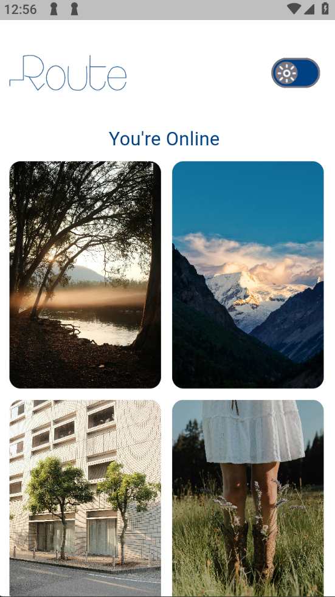
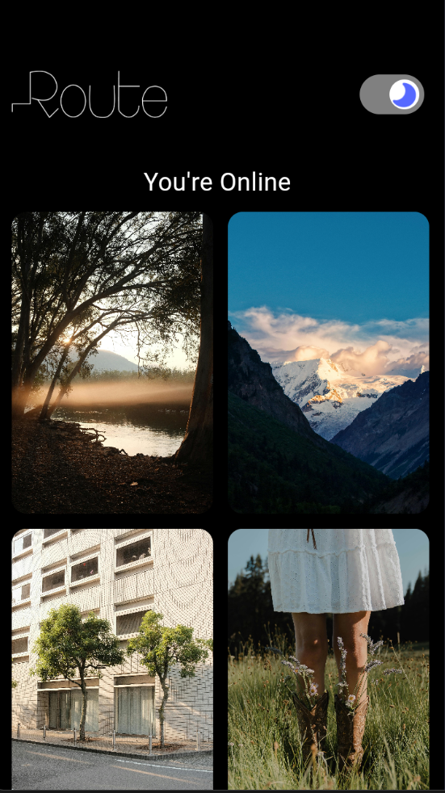
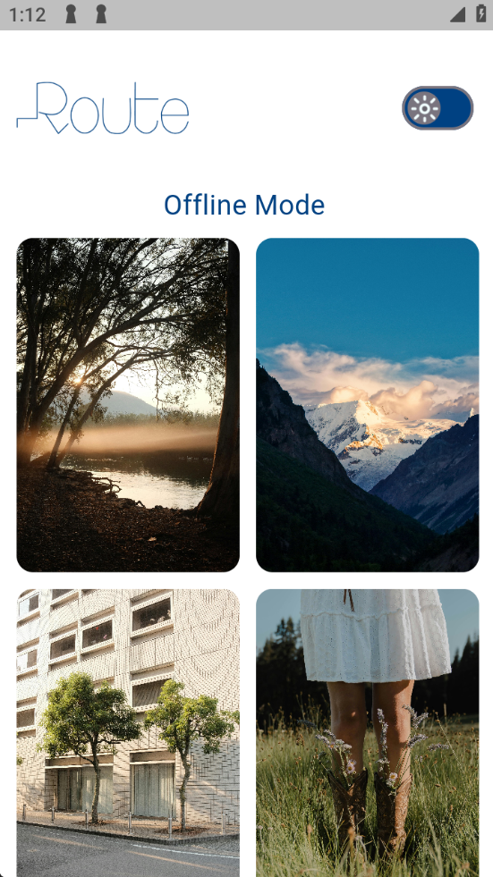
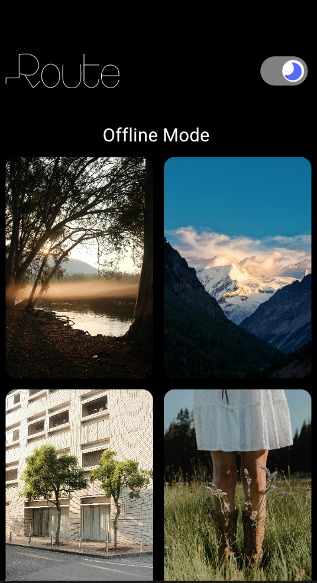
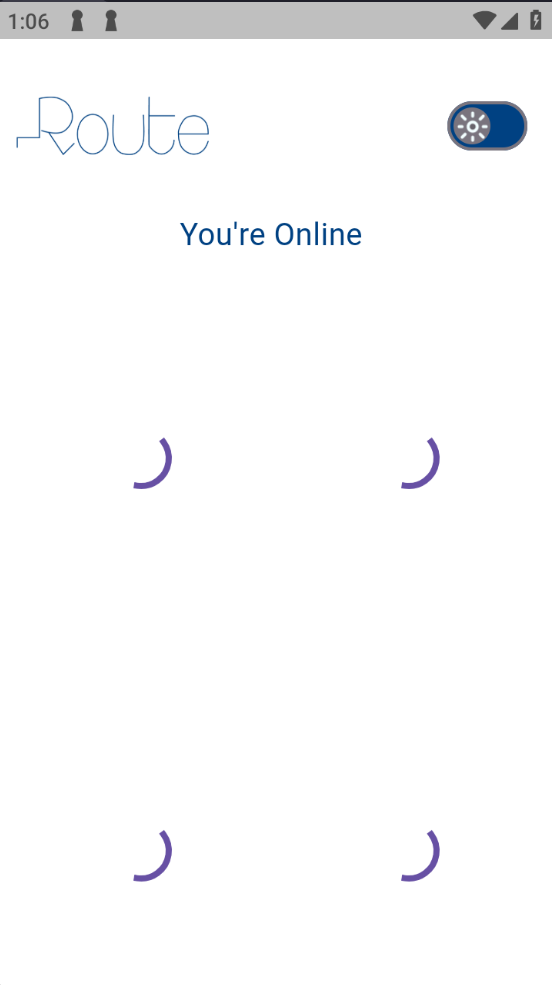
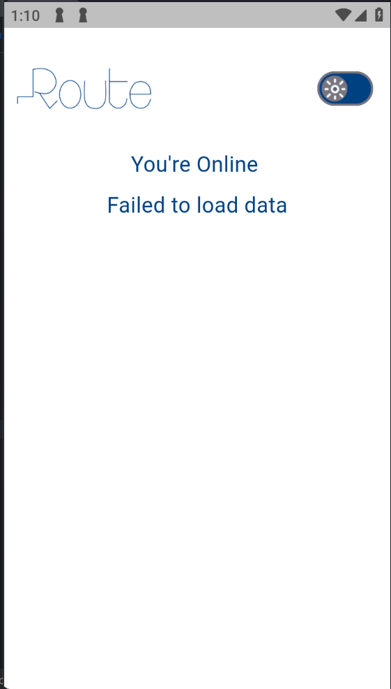
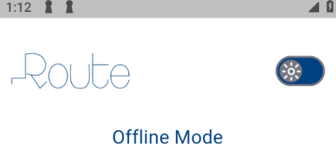

#### Photo Gallery App
A Flutter app that displays a list of curated photos using the Pexels API, with offline caching support and a real-time network status indicator.

#### Screenshots:

### Photo List Screen – Online (Light Mode)

### Photo List Screen – Online (Dark Mode)

### Photo List Screen (Offine/Cached - Light Mode):

### Photo List Screen (Offine/Cached - Dark Mode):

### Loading State:

### Error State:

### Network Status Indicator:
## online indicator:

## offline indiactor:

### A detailed explanation of the App Architecture:
The app follows Clean Architecture, separating code into clear layers:

## Presentation Layer

Handles UI and user interaction using Cubit/Bloc.

Displays data from the domain layer.

## Domain Layer

Contains core logic and entities (like Photo) and defines abstract repositories.

No Flutter or external package dependencies.

## Data Layer

Implements repositories using API (via Retrofit) and local storage (Hive).

Converts JSON to models using json_serializable.

## Use Cases

Sits between UI and domain, defining app-specific actions like fetching photos.

## Data flow:
UI => Use Case => Repository => Data Source (API/Cache) => Repository => UI

### Documentation on how to set up and run the project locally:
1. Clone the Project

git clone https://github.com/Mohamedmostafa952/photo_gallery_app.git

2. Install Dependencies
flutter pub get

3. Generate Code (For Retrofit & json_serializable)
flutter pub run build_runner build --delete-conflicting-outputs

4. Run the App
flutter run

